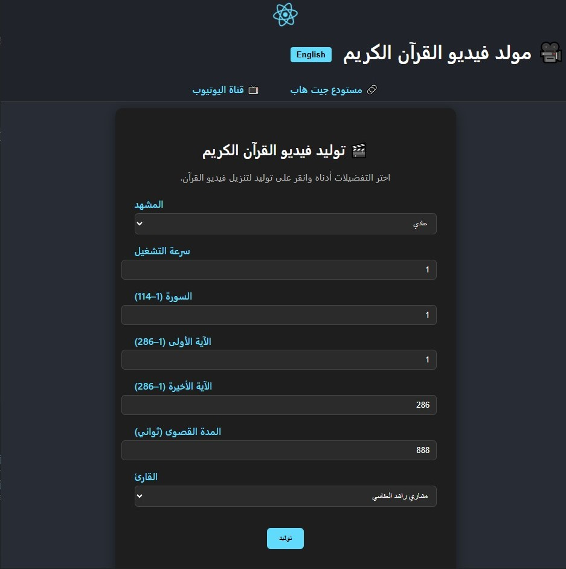

# Quran Video Generator | مولد فيديو القرآن الكريم

## Made with Remotion video and quranapi | مصنوع بـ Remotion و QuranAPI

<p align="center">
  <a href="https://github.com/remotion-dev/logo">
    
  </a>
  <hr>
  <a href="https://github.com/The-Quran-Project/Quran-API">
    
  </a>
</p>

## Documentation | التوثيق

**English:**

- Remotion Docs [fundamentals page](https://www.remotion.dev/docs/the-fundamentals)
- QuranAPI Docs [fundamentals page](https://quranapi.pages.dev)

**العربية:**

- وثائق Remotion [الصفحة الأساسية](https://www.remotion.dev/docs/the-fundamentals)
- وثائق QuranAPI [الصفحة الأساسية](https://quranapi.pages.dev)

---

## Demo | عرض توضيحي

<p align="center">
  
  
</p>

---

## How to use | طريقة الاستخدام

**English:**

1. Just run the Quran-video-generator.exe
2. Or use the commands below

**العربية:**

1. قم بتشغيل ملف Quran-video-generator.exe
2. أو استخدم الأوامر التالية

---

## Commands | الأوامر

**Install Dependencies | تثبيت المتطلبات**

```console
npm run install-quran
```

**Start Application | تشغيل التطبيق**

```console
npm run quran
```

**Render Video from config.ts | تصيير الفيديو من config.ts**

```console
npm run render
```

---

## API Usage | استخدام API

**Turn on only the API with | تشغيل واجهة API فقط باستخدام:**

```console
npm run api
```

**Do a POST request at | قم بطلب POST على:**

```console
http://localhost:3911/generate
```

**Request body | جسم الطلب:**

```json
{
  "scene": "normal",
  "playbackRate": 1,
  "surah": 114,
  "maxDuration": 888,
  "reciter": 1
}
```

---

## Quran Videos Made With This App | فيديوهات قرآنية مصنوعة بهذا التطبيق

### 9:16 Aspect Ratio | نسبة 9:16

[YouTube playlist with Remotion | قائمة تشغيل يوتيوب بـ Remotion](https://www.youtube.com/playlist?list=PLfeJYnlSUWwNBy_u5Jl7hM3Ph3GVkUbEq)

### 16:9 Aspect Ratio | نسبة 16:9

[YouTube video with Remotion | فيديو يوتيوب بـ Remotion](https://www.youtube.com/playlist?list=PLfeJYnlSUWwPPFFVnSHrTTp6UmPPAgnRw)

---

## Contributing | المساهمة

**English:**  
Feel free to open issues or pull requests to improve this project!

**العربية:**  
لا تتردد في فتح مشكلات أو طلبات سحب لتحسين هذا المشروع!
